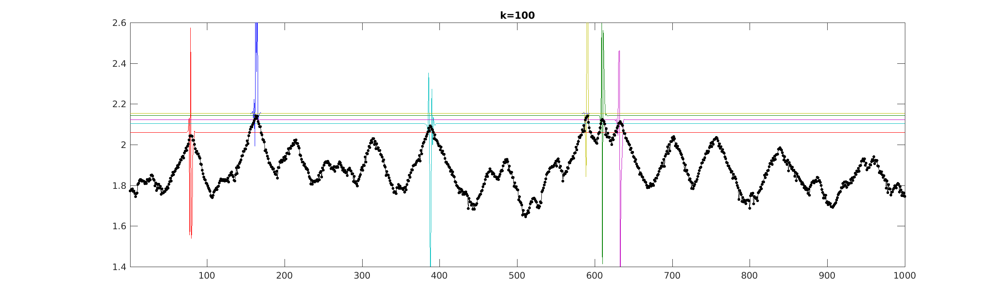

# localization-landscape

Exploring Lu-Steinerberger 2017 landscape function, and others,
for quickly extracting localized eigenfunctions of matrices
or operators.
So far we test random banded symmetric matrices _A_ of order _n_.
The landscape function is the vector whose components are the
2-norms of the rows of _A__k_,
where _k_ is the number
of iterations (matrix-vector products required).
This is estimated by the row norms of _A__k__R_ for an
iid random _n_-by-_p_ matrix _R_.

See their preprint

Alex Barnett 2/21/20

### Dependencies

MATLAB

### Demo

From MATLAB run ``steinerberger``. A screen animation occurs,
writing an AVI file, ending with a plot like this:

This is for matrix order ``n=1e3`` and half-bandwidth 2.
Since sparse matrices are used, you can easily go to ``n=1e5``
in a couple of seconds of CPU time.
